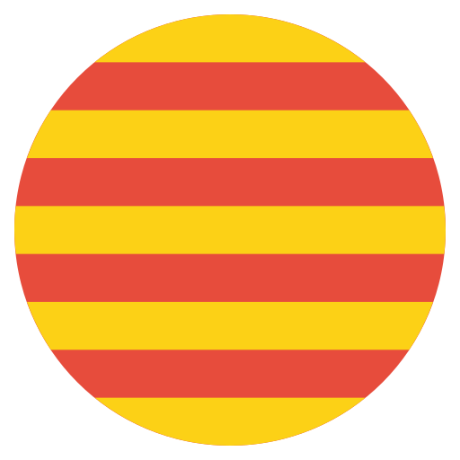
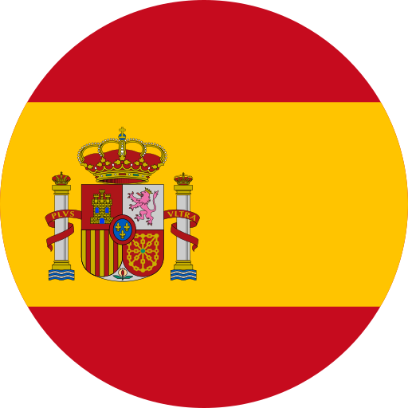
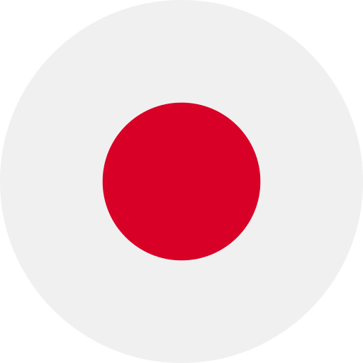

<h1 align="center">¡Hola! Soy <a href="https://www.linkedin.com/in/jorodrord/">Washi</a> ✌️</h1>

👉 💻 Vibe Coder | 💼 Junior Full-Stack Developer & 📋 Junior ITPD

𝐋𝐨𝐚𝐝𝐢𝐧𝐠, 𝐩𝐥𝐞𝐚𝐬𝐞 𝐝𝐨 𝐧𝐨𝐭 𝐭𝐮𝐫𝐧 𝐨𝐟𝐟 𝐭𝐡𝐞 𝐝𝐞𝐯𝐢𝐜𝐞. . .
_______________________________________________________________________________________________________________________________
𝐔𝐩𝐥𝐨𝐚𝐝𝐞𝐝 𝐬𝐮𝐜𝐜𝐞𝐬𝐬𝐟𝐮𝐥𝐥𝐲.
   
Oh, hola.

Desarrollar proyectos a inicios de la "Era de la IA" nunca ha sido tan sencillo; y a su vez, tan complicado. Es una extraña paradoja. Por ello, en este escenario de oferta constante y cambiante me presento como un 𝗱𝗲𝘀𝗮𝗿𝗿𝗼𝗹𝗹𝗮𝗱𝗼𝗿 𝘄𝗲𝗯 comprometido con la novedad y el aunar todo el conocimiento que me sea posible; y todo lo que ello comporta. Ofrezco soluciones a problemas conocidos o por conocer ejerciendo mi punto fuerte; la 𝗰𝗿𝗲𝗮𝘁𝗶𝘃𝗶𝗱𝗮𝗱, la 𝗰𝗼𝗹𝗮𝗯𝗼𝗿𝗮𝗰𝗶𝗼́𝗻 y la 𝘃𝗲𝗿𝘀𝗮𝘁𝗶𝗹𝗶𝗱𝗮𝗱.

Un "escritor" amateur con gusto por la poesía, los idiomas y la filosofía, que observa el fenómeno de la era digital con especial interés. . . Desde una cómoda lejanía. ☕

## About me 👀
- Coffeeholic ~ ☕
- Full-Stack Web Designer | Software Developer 🎓

 &nbsp;&nbsp;&nbsp;  &nbsp;&nbsp;&nbsp; &nbsp;&nbsp;&nbsp;  

## Find me at... ⬇️
